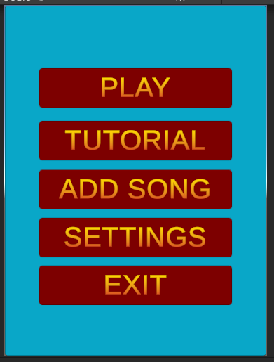

1st Class Dissertation Project

Mobile Gaming Application with Game Pattern Generation software

This project consisted of two core aspects. A mobile application with a music rhythm based game and a pattern generation software which would extract features from a song and generate a game pattern based on when features occur.

The application consisted of a menu system which allows the user upload and play songs of their own, modify visual aspects of the game and has an detailed tutorial of how to use the application.

The pattern generator works by extracting rhythmic features from a music track and generating a game pattern in the rhythm and tempo of that song. Firstly, the main pattern is generated by occurences of onsets in the track. An onset is the beginning of a new note or sound.
